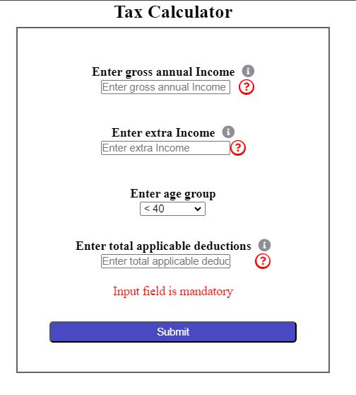
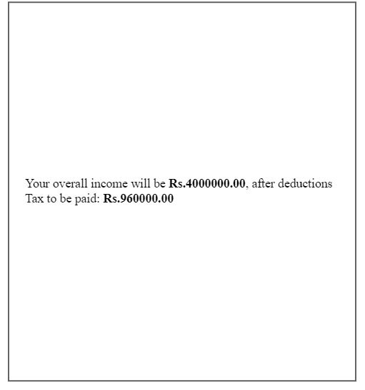
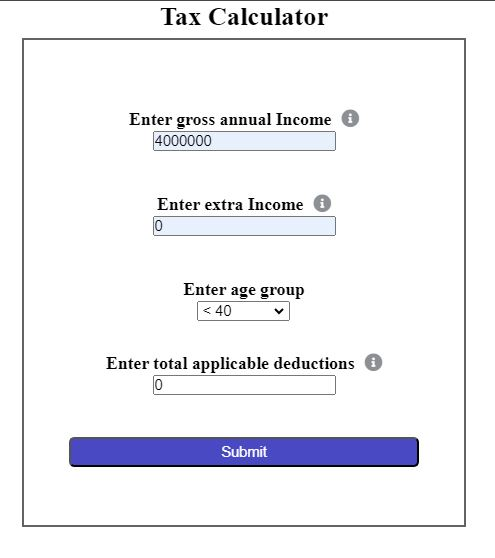
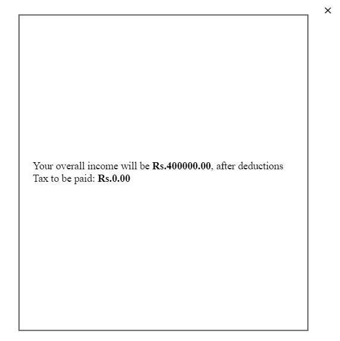
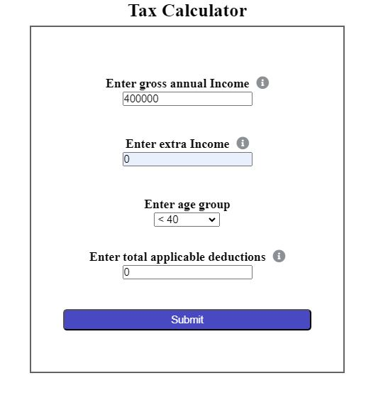
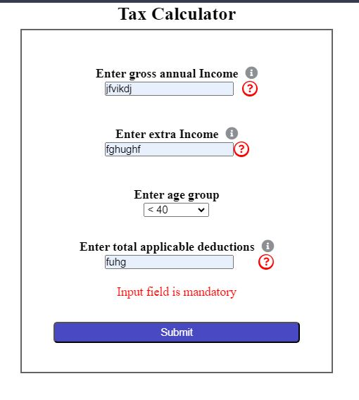

---
# Tax Calculator

This is a simple tax calculator web application that allows users to calculate their income tax based on their gross annual income, extra income, age group, and applicable deductions.








## Prerequisites

Before running this application, ensure you have the following installed:

- Node.js
- npm (Node Package Manager)

## Installation

1. Clone the repository to your local machine:

    ```bash
    git clone https://github.com/your-username/tax-calculator.git
    ```

2. Navigate to the project directory:

    ```bash
    cd tax-calculator
    ```

3. Install the required dependencies:

    ```bash
    npm install
    ```

## Running the Application

1. Start the local development server:

    ```bash
    npm start
    ```

2. Open your web browser and navigate to:

    ```
    http://localhost:3000
    ```

## Usage

1. Fill in the required fields:
    - Gross annual Income
    - Extra Income
    - Age group
    - Total applicable deductions

2. Click the "Submit" button to calculate the tax.

3. View the calculated tax and overall income in the modal that appears.

## Troubleshooting

- If you encounter any issues or errors, please check the browser console for more details.
- Ensure all input fields are filled correctly before submitting to get accurate results.

---
